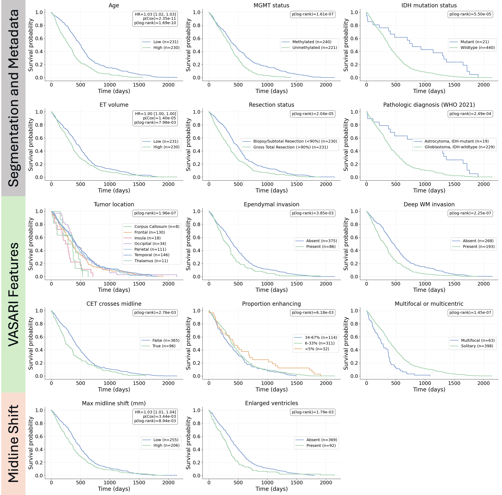

# BTReport 
[arXiv](https://arxiv.org/abs/2112.10752) | [BibTeX](#bibtex)

<!--   -->

[**BTReport: A Framework for Brain Tumor Radiology Report Generation with Clinically Relevant Features**](https://arxiv.org/abs/2508.10104) 

[Juampablo E. Heras Rivera](https://juampabloheras.github.io/)\*, Dickson T. Chen\*, Tianyi Ren, Daniel K. Low,   
Asma Ben Abacha, Alberto Santamaria-Pang, Mehmet Kurt 
\*equal contribution

<table>
<tr>
<td>

**[KurtLab, University of Washington](https://www.kurtlab.com/)**  
**[Microsoft Health AI, Microsoft](https://www.microsoft.com/en-us/research/lab/microsoft-health-futures/)**

</td>
<!-- <td width="200"></td> spacer column -->
<td align="right">
  
</td>
</tr>
</table>

## Clinically relevant features 
BTReport extracts a set of interpretable, clinically meaningful variables from each case, including patient demographics, VASARI morphology, and 3D midline shift measurements. These features summarize key aspects of tumor biology and mass effect that are routinely used in radiology reports and neuro-oncology decision-making.Kaplan–Meier analyses show that many of these features are predictive of overall survival, highlighting their clinical relevance and utility as structured inputs for downstream report generation.

  

## Overview
BTReport is an open-source framework for brain tumor radiology report generation using quantitative neuroimaging features.  BTReport first extracts clinically relevant features (patient metadata, VASARI features, midline shift) using a patients scan and tumor segmentation mask, then uses large language models for report formatting.

The framework consists of four components:
-  **[patient_metadata](./patient_metadata/)** — demographic and clinical information (e.g., age, sex, diagnosis, outcome).
-  **[vasari_features](./vasari_features/)** — standardized VASARI features.
-  **[midline_shift](./midline_shift/)** — quantitative estimation of 3D midline shift using a deep learning registration approach.
-  **[llm_report_generation](./llm_report_generation/)** — LLM synthesis of structured radiology reports grounded in deterministic features.

## Dataset
We provide a companion dataset which augments BraTS imaging with these features to further research in neuro-oncology report generation.

