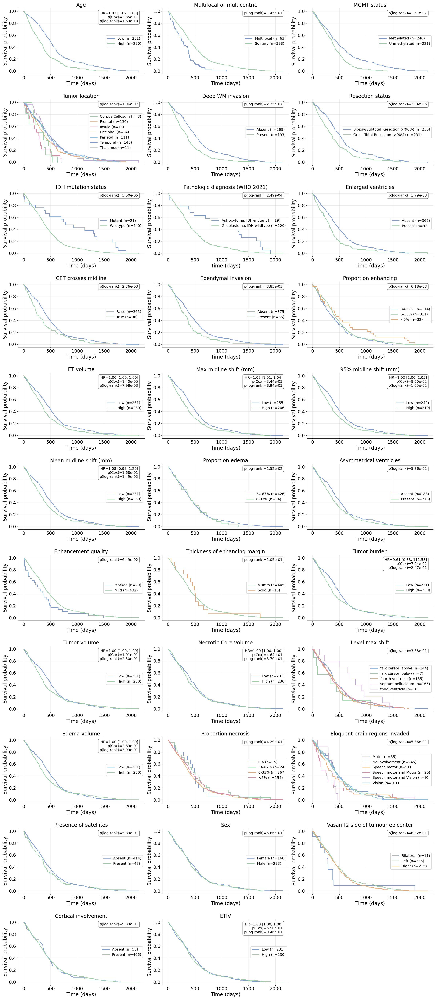

# Patient Metadata

This module organizes and preprocesses patient-level information for BTReport,
including demographics, clinical outcomes (e.g., survival_days), imaging-derived
features, and quantitative midline shift metrics. It also provides plotting
utilities for generating Kaplan–Meier-style survival curves.

## Data Overview

The datasheets directory contains:
- Core clinical tables (survival_days, IDH status, demographics)
- Imaging-derived features (flattened BraTS metadata)
- Midline shift metrics
- Cohort-specific metadata (TCGA, CPTAC, UPenn, UCSF)

`merge_metadata.py` joins these sources into a unified metadata table used by
BTReport.

## Kaplan–Meier Plots

The `assets/` directory contains several KM survival plots illustrating how
different patient characteristics relate to survival_days.  The figure below shows Kaplan–Meier Plots over all patient features collected, both significant (p < 0.05) and non-significant (p > 0.05).

