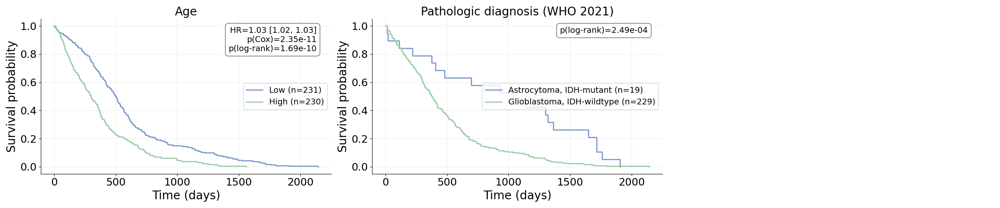
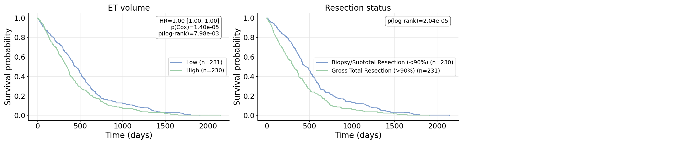
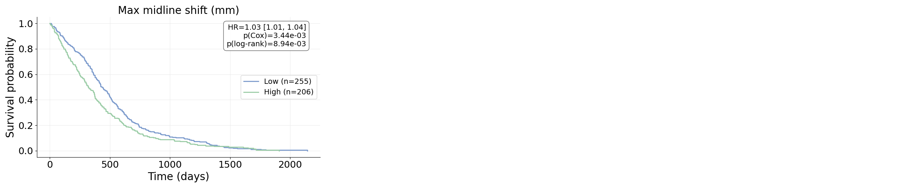

# Patient Metadata

This module organizes and preprocesses patient-level information for BTReport,
including demographics, clinical outcomes (e.g., survival_days), imaging-derived
features, and quantitative midline shift metrics. It also provides plotting
utilities for generating Kaplan–Meier-style survival curves.

## Directory Structure

patient_metadata/
├── README.md
├── merge_metadata.py
├── utils.py
├── metadata_analysis.ipynb
├── assets/
│   ├── demographics_vs_surv_KM.png
│   ├── lesionstats_vs_surv_KM.png
│   ├── midline_vs_surv_KM.png
│   ├── mutation_vs_surv_KM.png
│   └── vasari_vs_surv_KM.png
└── datasheets/
    ├── all_merged.csv
    ├── cleaned_merged.csv
    ├── brats23_metadata_flattened.csv
    ├── midline_summary.csv
    ├── GBM_Subjects_Spreadsheet.xlsx
    ├── UCSF-PDGM-Clinical.csv
    ├── CPTAC-GBM-Clinical.csv
    ├── UPENN-GBM_Clinical.csv
    └── TCGA-TCIA-BraTS-Mapping.xlsx

## Kaplan–Meier Plots

The `assets/` directory contains several KM survival plots illustrating how
different patient characteristics relate to survival_days. These plots assume
all observations are uncensored (no event column available).

### Demographics vs Survival

### Tumor Burden / Lesion Stats vs Survival

### Midline Shift vs Survival

### Molecular Mutations vs Survival

### VASARI Imaging Features vs Survival

## Data Overview

The datasheets directory contains:
- Core clinical tables (survival_days, IDH status, demographics)
- Imaging-derived features (flattened BraTS metadata)
- Midline shift metrics
- Cohort-specific metadata (TCGA, CPTAC, UPenn, UCSF)

`merge_metadata.py` joins these sources into a unified metadata table used by
BTReport.

